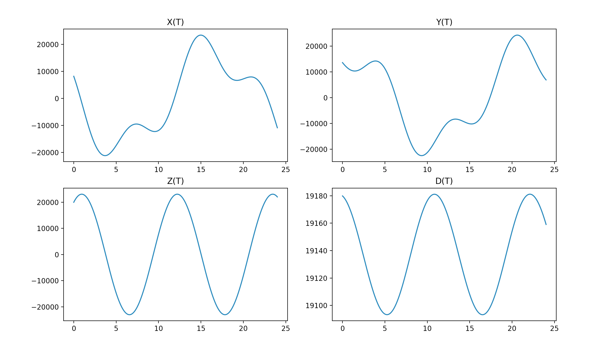
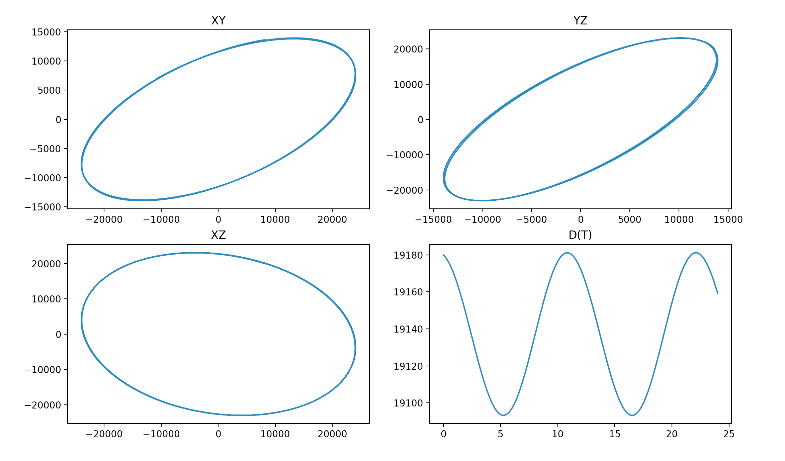
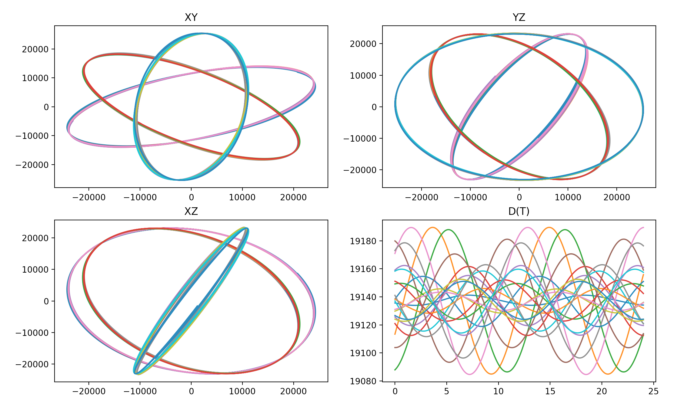
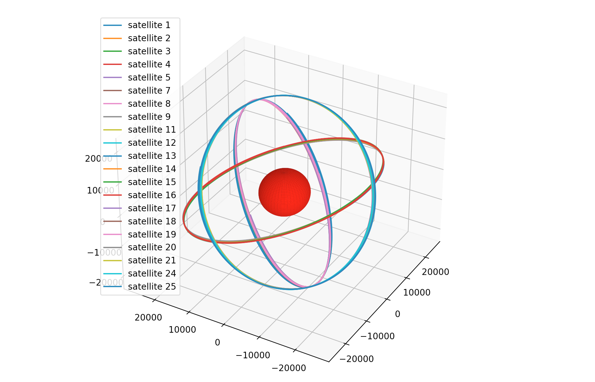

# NavStars

## Предисловие

Задание предполагает создание программно-математического обеспечения, которое позволяет визуализировать траектории движения навигационных спутников вокруг Земли. В общем случае модель движения исскуственного спутника Земли (ИСЗ)описывается сложными дифферциальными уравнениями высшых порядков не  имеющих аналитического решения и учитывающих влияние гравитационного поля нашей планеты, Солнца, Луны и других небесных тел, а также прочие факторы влияющие на положение ИСЗ, к примеру, давление солнечного света или внутрение шумы исполнительных устройств летательного аппарата.
Для упрощения решения задач, связанных с математическим или иммитационным моделированием движения ИСЗ, информационно-аналитические центры, такие как, к примеру Прикладной потребительский центр ГЛОНАСС(https://glonass-iac.ru), предоставляют открытый доступ к эфемеридам ИСЗ. 
Международным сообществом принято использовать два формата текстовых файлов *.SP3 и *.RINEX, в которых хранится положение навигационных ИСЗ. В формате RINEX эфемериды хранятся в оскулирующих элементах (Кеплеровы элементы орбиты) и для их обработки требуются специфичные знания в области небесной механики. В формате SP3 положения навигационных ИСЗ хранятся в декартовой системе координат, связанной с Землей, то есть система координат,которая вращается вместе с Землей. В рамках настоящего практикума предполагается использование файлов в формате SP3.
## Инструкция

### Структура файла SP3

Файл SP3 состоит из двух частей: заголовок и тело файла. Заголовок содержит большое количество служебной информации, большая часть которой при выполнении этого задания не потребуется. Строки тела файла содержат временные метки и координаты ИСЗ, соответствующие этим моментам времени. Строки тела файла начинаются либо с символа * и содержат метку времени, к которой относятся все строки координат до следующей метки времени, либо с символа P и соодержат собственно координаты ИСЗ. 
Формат строки со временем:
```
*  YYYY MM DD  hh  mm  s
```
где * - определяет, что это строка с меткой времени для всех последующих строк с положениями ИСЗ
YYYY - номер года, MM - номер месяца, DD - номер дня, hh - номер часа, mm - номер минуты, s - количество секунд
При этом s -  число вещественное, все остальные данные в такой строке целые

Формат строки с координатами:
```
PTN   X  Y  Z   dT
```
где P -  определяет, что это строка с позицией ИСЗ, T - определяет тип системы (“R”- ГЛОНАСС, “G” – GPS, «E» - Galileo, «C» - BeiDou, «J» - QZSS), N - номер спутника в этой системе (может быть двузначным целым числом), X - координата по оси х (направлена из центра Земли в точку пересечения гринвического меридиана и экватора), Y - координта по оси y (дополняет систему до правой тройки), Z - координата по оси z (направлена по оси вращения Земли), dT -  временная поправка (измеряется в мкс) 
Следует отметить отдельно, что координаты в файле SP3 представлены с шагом 15 минут

### Учет повората Земли вокруг своей оси
Координаты ИСЗ в файле SP3 представлены во вращающейся с Землей системе координат, для учета этого факта, перед построением графиков, необходимо домножить координаты вектора положения ИСЗ на матрицу поворота вокруг оси Z:

```
cos(a)  sin(a)   0
-sin(a)  cos(a)  0
0           0    1  
```
где a - угол поворота Земли вокруг своей оси, который может быть вычислен по следующему соотношению: a = - 2*pi *t, t- время прошедшее с начала суток.-----
Пересчет происходит по формуле:
```
X_t  = X * M
```
где X_t - вектор [x,y,z] - координат ИСЗ с учетом поворота Земли, M - матрица поворота на угол а, Х - вектор [x,y,z] - координат ИСЗ полученных из файла.

### Юлианская дата
Привычный нам способ измерения времени в виде номеров года, месяца, дня, часа, минут, секунд достаточно сложно использовать при математических вычислениях. Юлианская дата - это способ представления даты и времени в виде вещественного числа, в котором целая часть определяет количество дней, а дробная соответственно количество часов, минут, секунд прошедших внутри дня. Начало отсчета - полдень 1 января 4713 года до нашей эры.

Вычисление юлианской даты по дате календаря 
Далее используются обозначения:
year  — год. Для дат до нашей эры необходимо перевести год до н. э. в отрицательный год (например, 10 г. до н. э. = −9).
month  — номер месяца, январь — 1, февраль — 2 и т. д.
day  — день месяца.
hour  — часы от 0 до 23.
minute  — минуты от 0 до 59.
second  — секунды от 0 до 59, могут содержать дробную часть.
JDN  — номер юлианского дня (Julian Day Number), который начинается в полдень числа, для которого производятся вычисления.
JD  — юлианская дата содержащая дробную часть.
Вычисление номера юлианского дня (JDN) по дате григорианского календаря 
Вначале нужно вычислить промежуточные коэффициенты:
```
a=(14−month)/12
y=year+4800−a
m=month+12a−3 
```
После этого можно вычислить номер юлианского дня:
```
JDN=day+(153m+2)/5+365y+y/4−y/100+y/400−32045 
```
Все деления целочисленные, то есть остатки деления отбрасываются.
Формула справедлива для дат после 23 ноября −4713 г.

Вычисление юлианской даты (JD)
 
Для перехода к «полной» юлианской дате, содержащей дробную часть, можно воспользоваться формулой:
```
JD=JDN+(hour−12)/24+minute/1440+second/86400. 
```
При делении в этой формуле дробная часть не отбрасывается. Сутки не должны содержать високосной секунды (23:59:60).
Например, полдень (12 ч, 0 минут, 0 секунд) 1 января 2000 г. соответствует JD = 2451545,0.

Для выполнения задания, время представленное в файле SP3 в формате YYYY.MM.DD hh:mm:ss, необходимо будет переводить в формат юлианской даты.


### Рамки дозволенного

Для построения графического интерфейса пользователя рекомендуется использовать библиотеку tkinter или ее аналоги.
Для построения графиков рекомендуется использовать библиотеку matplotlib или ее аналоги.

### Задание
Необходимо разработать программу, которая считывает координаты из выбранного файла SP3 в папке navdata и строит двумерные и/или трехмерные  графики движения ИСЗ. В программе должен быть реализован графический интерфейс пользователя, который позволяет выбирать необходимое  навигационное созвездие (из доступных в текущем файле), выбрать ИСЗ с конкретным номером или все созвездие целиком для отрисовки, а также временной интервал внутри суток на котором отрисовывается движение ИСЗ. 

### Задание на "3"
Для выбранного пользователем спутника построить графики эволюции координат во времени и дальности до поверхности Земли во времени (X(T),Y(T),Z(T),D(T)) без учета поворота Земли вокруг своей оси.
Пример результата для одного спутника

### Задание на "4"
На отдельной фигуре для выбранного пользователем спутника построить графики эволюции координат и дальности до поверхности Земли во времени (X(T),Y(T),Z(T),D(T)) с учетом поворота Земли вокруг своей оси.
На отдельной фигуре для выбранного пользователем спутника или созвездия целиком  построить графики проекции траектории движения на плоскости XZ,XY,YZ.
Пример результата для одного спутника

Пример результата для нескольких спутников

### Задание на "5"
На отдельной фигуре для выбранного пользователем спутника построить графики эволюции координат во времени (X(T),Y(T),Z(T)) с учетом поворота Земли вокруг своей оси.
На отдельной фигуре для выбранного пользователем спутника или созвездия целиком  построить графики проекции траектории движения на плоскости XZ,XY,YZ.
На отдельной фигуре для выбранного пользователем спутника или созвездия целиком  построить графики траектории движения на трехмерной координатной плоскости.

### Задание на "5"
Добавить на фигуру с трехмерной координатной плоскостью помимо траектории движения спутника или всех спутников созвездия целиком, сферу радиус 6371 км, визуализирующую Землю.
Пример результата



